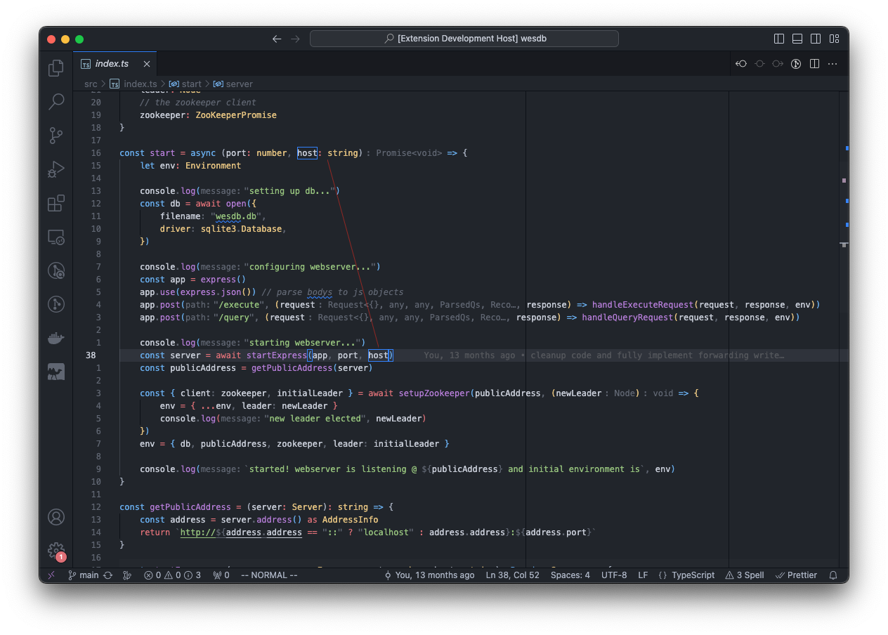

# VSCode Extension: Line to Definition

VSCode extension to draw a line from a symbol reference to a symbol definition in the same file.

## Configuration

-   Line Color
    -   The color of the line to display. Supports any SVG stroke color option.
    -   Default: `red`
-   Line Opacity
    -   The percentage opacity of the line when displayed.
    -   Default: `50` (50%)
-   Line Width
    -   The width of the line when displayed
    -   Default: `1`

## Find a bug?

Submit an issue following the issue guidelines of a code sample and photo
of the problem.

## License

[GNU GPLv3](LICENSE)
